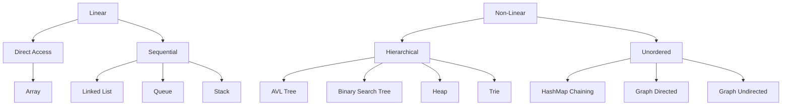

# Data Structures Research

Welcome to the **Data Structures Research** project! This repository is designed to help Python students enhance their knowledge and understanding of various **data structures**. Each data structure is organized into categories and subcategories, and every file is documented with comments explaining how each method works, including its **time complexity**.

## Table of Contents

- [Overview](#overview)
- [Project Structure](#project-structure)
  - [Linear Structures](#linear-structures)
    - [Direct Access](#direct-access)
    - [Sequential](#sequential)
  - [Non-Linear Structures](#non-linear-structures)
    - [Hierarchical](#hierarchical)
    - [Unordered](#unordered)
- [Searching Algorithms](#searching-algorithms)
- [Sorting Algorithms](#sorting-algorithms)
- [How to Use](#how-to-use)
- [Contributing](#contributing)

---

## Overview

This project is an educational resource for learning about different types of data structures in Python. It is aimed at students and enthusiasts who want to explore the internal workings of data structures, such as **arrays**, **linked lists**, **queues**, **stacks**, **trees**, **heaps**, **tries**, **hashmaps**, and **graphs**.

Each data structure implementation comes with:
- Methods to manipulate data within the structure.
- Detailed comments explaining what is happening in the code.
- Time complexity analysis for each method.

---

## Project Structure

The project is divided into two major categories of data structures: **Linear** and **Non-Linear**, with further subdivisions based on access types and behaviors.



### Linear Structures

#### 1. **Direct Access**
   - **Array**: This folder contains the implementation of arrays, a fundamental structure where elements can be accessed directly using their index.
     - `array.py`: Basic array operations, including insertions, deletions, and searching with O(1) direct access to elements.

#### 2. **Sequential**
   - **Linked List**: Linked lists are sequential structures where each element points to the next.
     - `circular_linked_list.py`: Implements circular linked lists, where the last node links back to the first node.
     - `doubly_linked_list.py`: Implements doubly linked lists, where each node points both to the next and the previous node.
     - `linked_list.py`: Implements singly linked lists with operations like insertion, deletion, and traversal.
   
   - **Queue**: Queues follow the First In, First Out (FIFO) principle.
     - `queue_deque.py`: Implements a queue using Python’s `deque` collection.
     - `queue_list.py`: Implements a queue using a simple list.
   
   - **Stack**: Stacks follow the Last In, First Out (LIFO) principle.
     - `stack_deque.py`: Implements a stack using Python’s `deque` collection.
     - `stack_list.py`: Implements a stack using a simple list.

### Non-Linear Structures

#### 1. **Hierarchical**
   - **AVL Tree**: Self-balancing binary search tree where the difference in heights between left and right subtrees is at most 1.
     - `avl_tree.py`: Implements insertions, deletions, and rotations to maintain balance.
   
   - **Binary Search Tree**: A tree structure where each node has at most two children, and the left subtree contains values less than the node, while the right contains greater values.
     - `binary_search_tree.py`: Implements the standard operations like insertion, searching, and traversal.
   
   - **Heap**: A complete binary tree used to implement priority queues.
     - `heap.py`: Implements both max-heaps and min-heaps, with insertions, deletions, and heapify operations.

   - **Trie**: A tree-like structure useful for storing strings and performing fast prefix searches.
     - `trie.py`: Implements insertions, searching, and prefix checks.

#### 2. **Unordered**
   - **HashMap**: A structure that maps keys to values using a hashing function for fast lookups.
     - **HashMapChaining**: Uses separate chaining to resolve collisions.
       - `hash_map_chaining.py
       - - **HashMapLinearProbing**: Uses open addressing with linear probing for collision resolution.
       - `hash_map_linear.py`: Implements a hash map using linear probing for collision resolution.

   - **Graphs**: Implements common graph algorithms and data structures for both directed and undirected graphs.
     - `graph_directed.py`: Implements a directed graph using adjacency lists, with algorithms for BFS, DFS, and topological sort.
     - `graph_undirected.py`: Implements an undirected graph using adjacency lists, with BFS, DFS, and connected components detection.

---
# Searching Algorithms

This section includes various searching algorithms.

- **Binary Search**:
  - `binary_search.py`: Implements binary search, a divide-and-conquer algorithm for sorted arrays.
  
- **Exponential Search**:
  - `exponential_search.py`: Implements exponential search for faster searching in a sorted array.
  
- **Jump Search**:
  - `jump_search.py`: Implements jump search, an algorithm that skips sections to find elements in a sorted array.
  
- **Linear Search**:
  - `linear_search.py`: Implements the simplest form of searching, checking elements sequentially.
  
- **Ternary Search**:
  - `ternary_search.py`: Implements ternary search, dividing the array into thirds for searching.

---

# Sorting Algorithms

This section covers common sorting algorithms.

- **Bubble Sort**:
  - `bubble_sort.py`: Implements bubble sort, a simple comparison-based sorting algorithm.
  
- **Bucket Sort**:
  - `bucket_sort.py`: Implements bucket sort, a distribution-based sorting algorithm.
  
- **Counting Sort**:
  - `counting_sort.py`: Implements counting sort, a non-comparison sorting technique.
  
- **Insertion Sort**:
  - `insertion_sort.py`: Implements insertion sort, which builds the sorted array one item at a time.
  
- **Merge Sort**:
  - `merge_sort.py`: Implements merge sort, a divide-and-conquer sorting algorithm.
  
- **Quick Sort**:
  - `quick_sort.py`: Implements quick sort, a highly efficient divide-and-conquer sorting algorithm.
  
- **Selection Sort**:
  - `selection_sort.py`: Implements selection sort, a comparison-based algorithm that selects the smallest (or largest) element each time.
---

## How to Use

To run and test the data structures:
1. Clone the repository:
   ```bash
   git clone https://github.com/yourusername/data-structures-research.git
   cd data-structures-research
   ```
2. Each file is standalone and can be executed individually to test the specific data structure, but there is also a main function.

## Example usage (for `array.py`):

```bash
python Linear/DirectAccess/Array/array.py
python main.py
```

## Contributing

Contributions are welcome! If you would like to contribute by improving existing code, adding new data structures, or fixing bugs, feel free to submit a pull request.

Please ensure all new code is properly commented and follows the time complexity analysis format used in existing files.


